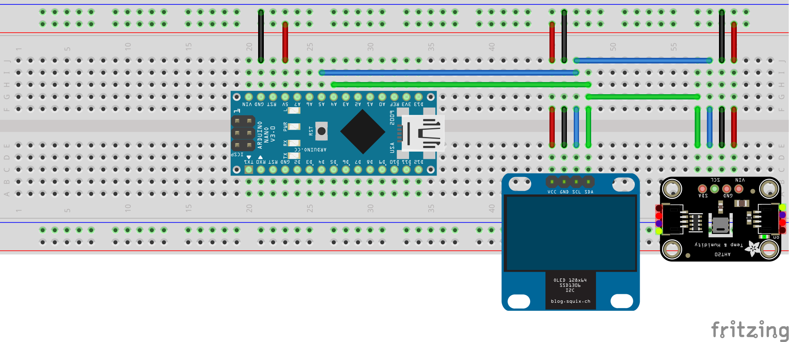

# Nano-Temperature-and-Humidity

This project is about creating a temperature and humidity sensor using Arduino Nano, a 0.96" OLED display, and an AHT10 (or AHT20) sensor. The project is developed using PlatformIO.

## Hardware Requirements

- Arduino Nano
- 0.96" OLED display
- AHT10 sensor
- Breadboard
- Jumper wires
- USB cable
- 5V power supply (optional)

## Software Requirements

- [PlatformIO](https://platformio.org/)

## Setup

1. Connect the Arduino Nano to the AHT10 sensor and the OLED display.
2. Open the project in PlatformIO.
3. Build and upload the code to the Arduino Nano.

## Images

Here are some images of the project:

Notice that the first image shows the schematic of the project realized on a breadboard. The second image shows the actual project.

## Code

The main code for the project is in `src/main.cpp`. The code is well commented and should be easy to understand. It is divided into two parts: the first part is the setup and the second part is the loop. The setup part is used to initialize the OLED display and the AHT10 sensor. The loop part is used to read the temperature and humidity from the sensor and display them on the OLED display.

## License

This project is licensed under the terms of the `LICENSE` file.