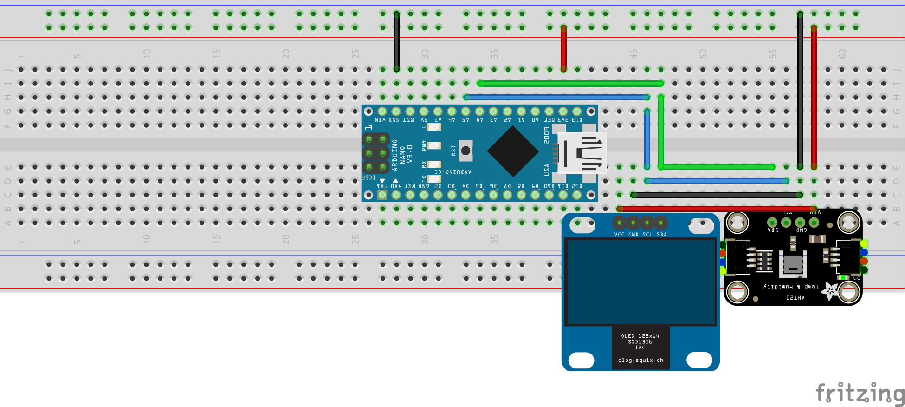
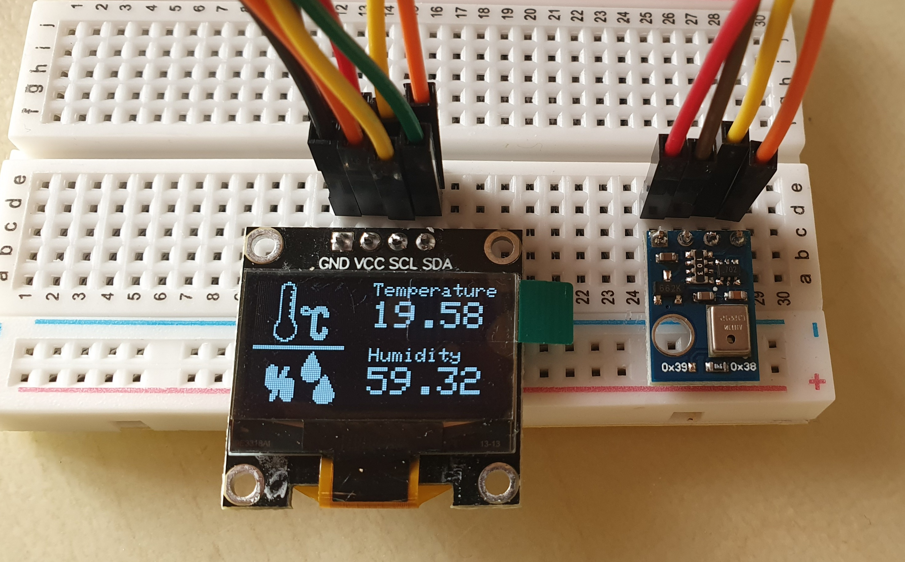

# Nano-Temperature-and-Humidity

This project is about creating a temperature and humidity sensor using Arduino Nano, a 0.96" OLED display, and an AHT10 (or AHT20) sensor. The project is developed using PlatformIO.

## Hardware Requirements

- Arduino Nano
- 0.96" OLED display
- AHT10 sensor
- Breadboard
- Jumper wires
- USB cable
- 5V power supply (optional)

## Software Requirements

- [PlatformIO](https://platformio.org/)

## Setup

1. Connect the Arduino Nano to the AHT10 sensor and the OLED display.
2. Open the project in PlatformIO.
3. Build and upload the code to the Arduino Nano.

## Images

Here are some images of the project:




Notice that the first image shows the schematic of the project realized on a breadboard. The second image shows the actual project.

## Code

The main code for the project is in `src/main.cpp`. The code is well commented and should be easy to understand. It is divided into two parts: the first part is the setup and the second part is the loop. The setup part is used to initialize the OLED display and the AHT10 sensor. The loop part is used to read the temperature and humidity from the sensor and display them on the OLED display.

## Low Power 
The LowPower library is used to put the Arduino Nano to sleep for 120 seconds between each reading. This is done to save power. In order to do so the Arduino will be put to sleep using the `LowPower.powerDown(SLEEP_8S, ADC_OFF, BOD_OFF);` command. The Arduino will wake up after 8 seconds and then go back to sleep. This will be repeated 15 times. After that it will wake up and read the temperature and humidity from the sensor. This will be repeated forever.

In order to lower the power consumption even more the clock speed of the Arduino is lowered from 16 MHz to 8 MHz. This is done by adding the following lines in setup:
```
CLKPR = 0x80;
CLKPR = 0x01;
```
The first line sets the CLKPCE bit in CLKPR to enable a change in the clock prescaler. The second line sets the CLKPS0 bit in CLKPR to divide the clock by 2.

The last thing that is done to lower the power consumption is to reduce the brightness of the OLED display. This is used to reduce the power consumption of the display that is always on. 

## License

This project is licensed under the terms of the `LICENSE` file.